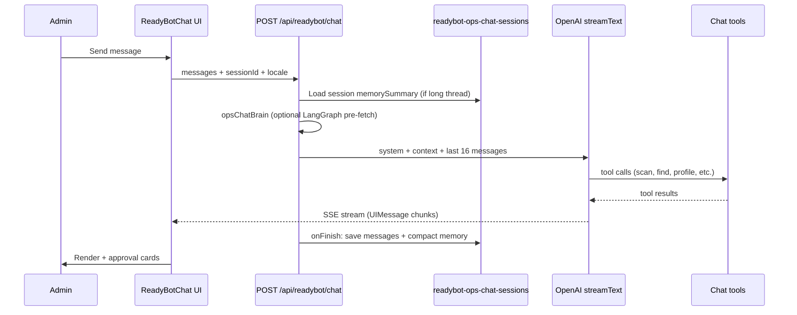

# ReadyBot — Architecture & Capability Reference

**ReadyBot** is the AI-powered candidate screening layer inside **ReadyToWork**. It automates CV understanding, role-fit scoring, WhatsApp outreach, reply extraction, safe profile updates, and human-in-the-loop review — with an **admin ops dashboard** and **ops chat** copilot.

**Last updated:** June 2026  
**Code root:** `src/readybot/` · **Dashboard:** `/{locale}/readybot` (admin-only)

---

## Table of contents

1. [What is working today](#1-what-is-working-today)
2. [System architecture](#2-system-architecture)
3. [Screening pipeline](#3-screening-pipeline)
4. [Ops dashboard](#4-ops-dashboard)
5. [Ops chat](#5-ops-chat)
6. [Data model & storage](#6-data-model--storage)
7. [APIs & entry points](#7-apis--entry-points)
8. [Automation (Trigger.dev)](#8-automation-triggerdev)
9. [Safety & permissions](#9-safety--permissions)
10. [Environment variables](#10-environment-variables)
11. [What is missing](#11-what-is-missing)
12. [Recommended capabilities to add](#12-recommended-capabilities-to-add)
13. [File map](#13-file-map)

---

## 1. What is working today

### Screening automation (backend)

| Capability | Status | Notes |
|------------|--------|-------|
| Batch scan of incomplete candidates | ✅ | CLI, dashboard button, Trigger cron, ops chat `runScan` |
| CV text extraction from PDF resume | ✅ | Via `extractCvText` + LLM summary → `candidate-memory` |
| Role fit vs job posting | ✅ | Score, gaps, recommended questions → `screening-results` |
| Screening task creation | ✅ | `candidate-screening-tasks` with status machine |
| Outbound WhatsApp (template + session) | ✅ | When `WHATSAPP_*` env configured |
| Inbound WhatsApp webhook | ✅ | `POST /api/whatsapp/webhook` → `inboundReplyWorkflow` |
| Reply parsing + validation (LLM) | ✅ | Extract fields from free-text replies |
| Safe auto-update vs human review routing | ✅ | `permissionTool.ts` allowlists |
| Human review queue | ✅ | Dashboard Review tab + Payload collection |
| Approve/reject human review (dashboard) | ✅ | `/api/readybot/approve-update`, `reject-update` |
| Follow-up messages (2-day gap, max 3 attempts) | ✅ | Trigger daily cron + `pnpm readybot:followup` |
| Candidate memory compaction | ✅ | After 3+ messages; LLM summarizes working memory |
| LangGraph multi-agent scan | ✅ | Partitions queue across parallel scanner workers |
| Workflow audit trail | ✅ | Every step → `agent-audit-logs`; powers Live tab |
| QA test candidates seed | ✅ | `pnpm seed:readybot-test-candidates` (10 scenarios) |

### Ops dashboard (frontend)

| Capability | Status | Route / tab |
|------------|--------|-------------|
| Overview stats + status breakdown | ✅ | Overview |
| Scan & automation panel | ✅ | Overview — settings, Trigger config, manual run |
| Ops chat (ChatGPT-style) | ✅ | Chat — sidebar history, stop/edit/regenerate |
| Live activity feed | ✅ | Live — polls every ~3.5s |
| Screening results table | ✅ | Results |
| Screening tasks table | ✅ | Tasks |
| Candidate messages table | ✅ | Messages |
| Candidate memory table | ✅ | Memory |
| Human review queue (approve/reject UI) | ✅ | Review |
| Agent audit logs | ✅ | Audit |
| Pipeline candidates list | ✅ | Pipeline |
| Per-candidate detail page | ✅ | `/readybot/candidates/{id}` |

### Ops chat agent tools

| Tool | Status |
|------|--------|
| `runScan` | ✅ |
| `getPipelineStats` | ✅ |
| `listCandidates` | ✅ (ReadyBot pipeline only, paginated) |
| `findCandidate` | ✅ (name / email / job title search) |
| `getCandidateProfile` | ✅ (full snapshot + memory + screening + messages) |
| `listPendingReviews` | ✅ (read-only list) |
| `updateCandidateProfile` | ✅ (requires inline Approve/Deny in chat) |

### Not ReadyBot — rest of ReadyToWork platform

ReadyToWork also has candidate/employer portals, interview moderation, payments (MyFatoorah), public candidate directory, CMS, etc. Those are **separate** from ReadyBot unless explicitly integrated later.

---

## 2. System architecture

```mermaid
flowchart TB
  subgraph triggers [Entry points]
    CLI["CLI: readybot:scan / followup"]
    Dash["Dashboard: Run scan button"]
    Chat["Ops chat: runScan tool"]
    Cron["Trigger.dev cron"]
    WA["WhatsApp webhook"]
  end

  subgraph orchestration [Orchestration]
    ScanJob["scanIncompleteCandidates"]
    ScanLG["LangGraph scanGraph\n(parallel agents)"]
    ScreenWF["candidateScreeningWorkflow\n→ fullScreeningWorkflow"]
    InboundWF["inboundReplyWorkflow"]
    FollowWF["followUpWorkflow"]
    MemWF["memoryCompactionWorkflow"]
  end

  subgraph llm [LLM layer]
    OpenAI["OpenAI / READYBOT_LLM_API_KEY"]
    Extract["Extraction / validation prompts"]
    RoleFit["compareRoleFit"]
    ScreenMsg["generateScreeningMessage"]
    Compact["compactMemoryWithLlm"]
    ChatBrain["opsChatBrain LangGraph"]
    ChatStream["streamText + tools"]
  end

  subgraph data [PostgreSQL via Payload]
    Cand["candidates.readyBot.*"]
    SR["screening-results"]
    ST["candidate-screening-tasks"]
    CM["candidate-messages"]
    Mem["candidate-memory"]
    HR["human-review-tasks"]
    Audit["agent-audit-logs"]
    Settings["global: ready-bot-settings"]
    ChatSess["readybot-ops-chat-sessions"]
  end

  subgraph external [External]
    MetaWA["Meta WhatsApp Cloud API"]
    TriggerCloud["Trigger.dev scheduler"]
    R2["R2/S3 — CV files in media only"]
  end

  CLI --> ScanJob
  Dash --> ScanJob
  Chat --> ScanJob
  Cron --> ScanJob
  ScanJob --> ScanLG
  ScanLG --> ScreenWF
  ScreenWF --> OpenAI
  WA --> InboundWF
  InboundWF --> OpenAI
  Cron --> FollowWF
  InboundWF --> MemWF

  ScreenWF --> SR
  ScreenWF --> ST
  ScreenWF --> CM
  ScreenWF --> Mem
  ScreenWF --> Audit
  InboundWF --> HR
  InboundWF --> Cand
  FollowWF --> CM

  ScreenWF --> MetaWA
  FollowWF --> MetaWA

  Chat --> ChatStream
  ChatStream --> ChatBrain
  ChatStream --> OpenAI
  ChatStream --> ChatSess
  ChatStream --> data

  ScanJob --> Settings
  Cand --> R2
```



### High-level layers

| Layer | Responsibility |
|-------|----------------|
| **Entry points** | CLI, dashboard API, ops chat tools, Trigger cron, WhatsApp webhook |
| **Workflows** | Composable pipelines in `src/readybot/workflows/` |
| **Services** | Business logic (detect missing fields, parse replies, role fit, etc.) |
| **Tools** | Payload CRUD, WhatsApp send, audit log, LLM helpers, permissions |
| **Dashboard** | React UI at `src/components/readybot/` |
| **Ops chat** | Vercel AI SDK streaming + tool calling + Postgres session store |

---

## 3. Screening pipeline

### End-to-end flow

```txt
Candidate in queue (screeningStatus: new | incomplete | contacted | info_received)
  │
  ├─ Skip if readyBotEnabled=false or profile complete (no missing fields)
  │
  ▼
fullScreeningWorkflow
  ├─ ① Load candidate + CV URL
  ├─ ② extractCvText → LLM → cvSummary (candidate-memory)
  ├─ ③ compareRoleFit vs job-posting (READYBOT_DEFAULT_JOB_POSTING_ID)
  │     → screening-results (fitScore, gaps, recommendedQuestions)
  ├─ ④ detectMissingFields → readyBot.missingFields
  ├─ ⑤ generateScreeningMessage (LLM, tailored questions)
  ├─ ⑥ createScreeningTask
  ├─ ⑦ WhatsApp outbound (template first / session message follow-up)
  └─ ⑧ update readyBot screening meta (status, lastContactedAt, etc.)

Inbound WhatsApp reply (webhook)
  ├─ inboundReplyWorkflow
  ├─ parseCandidateReply (LLM extraction)
  ├─ validateExtractedData
  ├─ filterSafeExtractedFields (permissionTool)
  │     ├─ Safe fields → auto-update candidate profile
  │     └─ Sensitive fields → human-review-tasks
  ├─ Optional: memory compaction after 3+ messages
  └─ Audit log every step

Follow-up (daily cron / CLI)
  ├─ Tasks status=awaiting_reply, lastSentAt > 2 days ago
  ├─ Max 3 attempts → mark unresponsive
  └─ Regenerate + send follow-up message
```

### LangGraph scan (optional, default ON in settings)

When `useLangGraphMultiAgent` is enabled:

1. **Supervisor** fetches up to 50 candidates from scan queue.
2. **Partition** candidates across N parallel agents (1–8, default 3).
3. Each agent runs `runCandidateScreeningWorkflow` on its bucket.
4. Results aggregated; batch logged under shared `workflowRunId`.

Config: global `ready-bot-settings` or per-run override from dashboard.

### Screening statuses (`candidates.readyBot.screeningStatus`)

Typical values: `new`, `incomplete`, `contacted`, `info_received`, `complete`, `unresponsive`, `opted_out`, etc. (see `candidateReadyBot.ts` and dashboard StatusBadge).

---

## 4. Ops dashboard

**URL:** `/{locale}/readybot`  
**Access:** Admin users only (`readybot/layout.tsx` enforces role).

### Tabs

| Tab | Data source |
|-----|-------------|
| Overview | `loadReadyBotDashboard()` — batched Payload queries |
| Chat | Client-side + `/api/readybot/chat/*` |
| Live | `agent-audit-logs` polled via `/api/readybot/live-logs` |
| Results | `screening-results` |
| Tasks | `candidate-screening-tasks` |
| Messages | `candidate-messages` |
| Memory | `candidate-memory` |
| Review | `human-review-tasks` (pending) |
| Audit | `agent-audit-logs` |
| Pipeline | Candidates with ReadyBot enabled or active screening status |

### Scan & automation panel (Overview)

- **Default scan behavior:** LangGraph on/off, parallel agent count (1–8), LangGraph chat brain
- **Trigger automation:** enable/disable scheduled scan, min interval between runs, follow-ups toggle
- **Run scan now:** immediate batch with optional one-run agent override
- **Save settings:** persists to `ready-bot-settings` global

### Candidate detail

`/{locale}/readybot/candidates/{id}` — memory, results, tasks, messages, reviews, audits for one candidate.

---

## 5. Ops chat

### Architecture



### UI features (production chat)

| Feature | Implementation |
|---------|----------------|
| Saved chat history | `readybot-ops-chat-sessions` per admin user |
| Sidebar + new/rename/delete | `/api/readybot/chat/sessions` |
| URL deep links | `?tab=chat&chat={sessionId}` |
| Stop generation | `useChat().stop()` + persist partial messages |
| Edit & resend | Truncate thread from edited message → `regenerate` |
| Regenerate assistant | Hover → refresh on assistant messages |
| Profile edit approval | `updateCandidateProfile` with `needsApproval: true` |
| Session memory compaction | After 8+ messages → `memorySummary` + `keyFacts` in DB |
| Context window | Last 16 messages to LLM + injected session summary |

### Chat tools detail

**`getCandidateProfile`** returns:

- Identity: `firstName`, `lastName`, `fullName`, `label`, email, phone, WhatsApp
- Profile: job title, skill, location, experience, visa, resume URL
- ReadyBot: screening status, missing fields, opt-in, channels
- `agentMemory`: CV/conversation summaries, confirmed/unconfirmed fields
- `latestScreening`: fit score, gaps, questions
- `recentMessages`: last 8 WhatsApp/email bodies
- `screeningTasks`: active task statuses

**`updateCandidateProfile`** allowed fields (chat allowlist):

`jobTitle`, `primarySkill`, `location`, `experienceYears`, `aboutMe`, `whatsapp`, `nationality`, `languages`, `visaStatus`, `visaExpiry`, `visaProfession`, `readyBot.whatsappNumber`, `readyBot.preferredContactChannel`, `jobPreferences.preferredSalary`, `jobPreferences.preferredLocation`

**Not editable via chat:** `firstName`, `lastName`, `email`, `phone`, `billingClass`, etc.

### Ops chat brain (`useLangGraphChatBrain`)

When enabled, before streaming:

1. Classify intent: `scan` | `query` | `profile` | `chat`
2. Pre-run matching tools (e.g. `getPipelineStats`, `findCandidate`)
3. Inject summary into system prompt to reduce duplicate tool calls

---

## 6. Data model & storage

### PostgreSQL (Payload collections)

| Collection / global | Purpose |
|---------------------|---------|
| `candidates` + `readyBot` group | Screening status, missing fields, WhatsApp prefs, opt-in |
| `screening-results` | Role fit scores, gaps, questions per candidate/job |
| `candidate-screening-tasks` | Outreach state, attempts, channel |
| `candidate-messages` | Inbound/outbound message bodies |
| `candidate-memory` | LLM working memory (1 row per candidate) |
| `human-review-tasks` | Pending field updates from WhatsApp extraction |
| `agent-audit-logs` | Immutable workflow step trail |
| `readybot-ops-chat-sessions` | Ops chat transcripts + session memory |
| `ready-bot-settings` (global) | LangGraph, automation, agent count |
| `job-postings` | Role fit comparison target |

### Object storage (R2 / S3 / Vercel Blob)

**Only** `media` collection (CV PDFs, profile photos). Chat text and memory live in Postgres, not S3.

### Candidate memory vs ops chat memory

| | Candidate memory | Ops chat session memory |
|--|------------------|-------------------------|
| **Scope** | Per candidate (screening agent) | Per admin chat thread |
| **Used by** | WhatsApp pipeline, compaction | Ops chat LLM context |
| **Fields** | `cvSummary`, `conversationSummary`, confirmed fields | `memorySummary`, `keyFacts` |
| **Compaction** | After inbound messages | After 8+ chat messages |

---

## 7. APIs & entry points

### ReadyBot HTTP APIs

| Method | Path | Purpose |
|--------|------|---------|
| GET/POST | `/api/readybot/settings` | Load/save runtime settings |
| POST | `/api/readybot/run-scan` | Fire-and-forget scan (admin) |
| GET | `/api/readybot/live-logs` | Live tab polling |
| POST | `/api/readybot/approve-update` | Approve human review task |
| POST | `/api/readybot/reject-update` | Reject human review task |
| POST | `/api/readybot/chat` | Streaming ops chat |
| GET/POST | `/api/readybot/chat/sessions` | List/create chat sessions |
| GET/PATCH/DELETE | `/api/readybot/chat/sessions/[id]` | Load/rename/delete session |
| PUT | `/api/readybot/chat/sessions/[id]/messages` | Persist messages (edit/stop) |
| GET/POST | `/api/whatsapp/webhook` | Meta verify + inbound messages |

### CLI scripts

```bash
pnpm seed:readybot-test-candidates   # 10 QA candidates
pnpm readybot:scan                   # Manual scan batch
pnpm readybot:followup               # Manual follow-up batch
```

### Trigger.dev tasks (`src/trigger/readybotTasks.ts`)

| Task ID | Schedule | Behavior |
|---------|----------|----------|
| `readybot-scan-incomplete` | `*/15 * * * *` | Respects `automatedScanEnabled` + `scanIntervalMinutes` |
| `readybot-send-followups` | `0 9 * * *` | Respects `automatedFollowUpEnabled` |
| `readybot-process-inbound` | Event task | Available for async inbound processing |

---

## 8. Automation (Trigger.dev)

### How dashboard settings interact with Trigger

- **Cron tick** is fixed at deploy time (`*/15 * * * *` for scan).
- **`scanIntervalMinutes`** controls how often a tick actually runs a scan (checks `lastAutomatedScanAt`).
- **`automatedScanEnabled`** — when off, scheduled task exits immediately.
- Deploy required after code changes: `npx trigger.dev@latest deploy`

### Manual vs scheduled scan

| Source | `source` flag | Affects automation timer |
|--------|---------------|--------------------------|
| Dashboard / API / chat | `manual` | No |
| Trigger cron | `scheduled` | Updates `lastAutomatedScanAt` |

---

## 9. Safety & permissions

### Three write paths to candidate profiles

| Path | Who approves | Field rules |
|------|--------------|-------------|
| WhatsApp auto-update | Automatic if safe + confident | `SAFE_AUTO_UPDATE_FIELDS` |
| WhatsApp → human review | Admin in **Review tab** | Sensitive fields in `HUMAN_REVIEW_ONLY_FIELDS` |
| Ops chat `updateCandidateProfile` | Admin **inline in chat** | `CHAT_PROFILE_FIELD_KEYS` allowlist |

### Forbidden actions (never implemented)

`delete_candidate`, `change_employer_credits`, `approve_employer_payment`, `final_hiring_decision`, `delete_audit_logs`, `generic_db_update`

### Human review only (never auto-applied from WhatsApp)

Includes: `visaStatus`, `primarySkill`, `billingClass`, legal/eligibility fields, etc.

---

## 10. Environment variables

```env
# LLM (required for screening + chat)
OPENAI_API_KEY=                      # or READYBOT_LLM_API_KEY
READYBOT_LLM_MODEL=gpt-4o-mini

# Role fit default job
READYBOT_DEFAULT_JOB_POSTING_ID=

# Optional LangGraph for single-candidate screening graph
READYBOT_USE_LANGGRAPH=1

# WhatsApp (optional — pipeline runs but skips send without these)
WHATSAPP_ACCESS_TOKEN=
WHATSAPP_PHONE_NUMBER_ID=
WHATSAPP_WEBHOOK_VERIFY_TOKEN=
READYBOT_WHATSAPP_TEMPLATE_NAME=profile_completion_v1

# Local dev: optional explicit on (default on when NODE_ENV !== production)
READYBOT_ENABLED=1
# Production (Vercel): leave UNSET or READYBOT_ENABLED=0 until go-live — dashboard, APIs, webhook, and Trigger crons return 404 / no-op

# Trigger.dev (optional — for scheduled automation)
TRIGGER_PROJECT_REF=
TRIGGER_SECRET_KEY=

# Database (required)
DATABASE_URI=
PAYLOAD_SECRET=
```

---

## 11. What is missing

### Ops chat agent gaps

| Gap | Impact |
|-----|--------|
| **Approve/reject human review from chat** | Can list pending reviews only; must use Review tab |
| **Send WhatsApp manually** | No on-demand message to one candidate |
| **Trigger follow-up on demand** | Only CLI/cron; chat can't run `followUpWorkflow` |
| **Scan single candidate by ID** | Batch scan only |
| **Read/parse CV PDF in chat** | Only `resumeUrl` + stored `cvSummary` |
| **Search all candidates** | `listCandidates` is pipeline-only, not full directory |
| **Semantic/vector search** | Site has pgvector embeddings; chat uses `contains` search |
| **Job posting picker** | Single env default job; can't compare multiple roles in chat |
| **Edit name/email/phone** | Intentionally excluded from chat allowlist |
| **Toggle readyBotEnabled per candidate** | No chat tool |
| **Change automation settings from chat** | Dashboard only |
| **Cross-session admin memory** | Per chat thread only |
| **Bulk operations** | No multi-approve or batch profile edits |

### Pipeline / platform gaps

| Gap | Notes |
|-----|-------|
| **Email channel outreach** | Schema supports email; WhatsApp is primary implementation |
| **Multi job posting per scan** | One default job per batch |
| **Employer/interview integration** | ReadyBot doesn't connect to interview moderation |
| **Proactive alerts** | No webhook/Slack when queue backs up |
| **CV re-extraction on demand** | No "refresh CV summary" button |
| **Trigger inbound as async task** | Webhook runs inline; `readybot-process-inbound` exists but webhook uses direct call |
| **Production hardening** | Rate limits, chat tool audit per admin action, retry dashboards |

### Documentation / ops gaps

| Gap | Notes |
|-----|-------|
| Runbook for failed scans | Informal (Live tab + terminal logs) |
| Metrics / SLA dashboard | Counts only, no time-series |
| Staging vs prod job posting config | Single env var |

---

## 12. Recommended capabilities to add

Prioritized by ops value and implementation effort.

### P0 — High impact, builds on existing code

| Capability | Why |
|------------|-----|
| **`approveHumanReview` / `rejectHumanReview` chat tools** | Closes biggest gap between chat and Review tab |
| **`runFollowUp` chat tool + dashboard button** | Ops often need on-demand nudge |
| **`scanCandidate` (single ID)** | Targeted re-screen without full batch |
| **`sendWhatsAppMessage` (admin-approved)** | Manual outreach with audit trail |
| **Job posting selector in settings + chat** | Role fit accuracy for multi-role platform |

### P1 — Medium impact

| Capability | Why |
|------------|-----|
| **`searchAllCandidates`** with filters + pgvector | Match employer directory search quality |
| **`reextractCv` tool** | Refresh summary after new resume upload |
| **`setReadyBotEnabled` tool** | Ops control without Payload admin |
| **Chat action audit logs** | Log every tool call with admin user ID |
| **Human review preview in chat** | Show proposed before/after on approve tool |
| **Export pipeline CSV** | Reporting for ops |

### P2 — Strategic / larger scope

| Capability | Why |
|------------|-----|
| **Cross-chat ops memory** | "Remember we always use job posting X for electricians" |
| **Slack/email alerts** | Pending review threshold notifications |
| **Employer-facing ReadyBot status** | Show screening progress to employers |
| **Interview handoff** | Auto-suggest interview when profile complete + fit > N |
| **Multi-language WhatsApp templates** | Arabic/English template selection |
| **Evaluation harness** | Regression tests on extraction/role-fit quality |
| **Candidate-facing status page** | What we asked, what we still need (GDPR-friendly) |

### P3 — Platform integration

| Capability | Why |
|------------|-----|
| Moderator interview tools in ops chat | Single admin copilot for whole platform |
| Employer credit / plan visibility | Support ops without switching to Payload |
| CMS/content ops | Probably out of scope for ReadyBot |

---

## 13. File map

```txt
src/readybot/
  workflows/          # scanGraph, fullScreening, inbound, followUp, memoryCompaction
  services/           # detectMissingFields, compareRoleFit, parseReply, applyHumanReview, …
  tools/              # payloadTool, whatsappTool, llmTool, permissionTool, workflowTrace
  chat/               # tools, toolActions, systemPrompt, opsChatBrain, profileFields
  prompts/            # extraction, validation, screening message, memory compaction
  lib/                # getReadyBotPayload, candidateReadyBot, openaiClient

src/trigger/
  readybotTasks.ts
  scanIncompleteCandidates.ts

src/lib/readybot/
  dashboardData.ts    # Dashboard loader (batched queries)
  settings.ts         # Runtime settings global
  chatSessions.ts     # Ops chat persistence
  compactOpsChatMemory.ts
  liveLogs.ts

src/components/readybot/
  ReadyBotDashboard.tsx
  ReadyBotChat.tsx / ReadyBotChatThread.tsx / ReadyBotChatMessage.tsx
  ReadyBotOpsPanel.tsx
  ReadyBotLiveFeed.tsx
  ReadyBotShell.tsx

src/app/api/readybot/   # All ReadyBot HTTP routes
src/app/api/whatsapp/webhook/

src/collections/        # ScreeningResults, CandidateScreeningTasks, CandidateMessages,
                        # CandidateMemory, HumanReviewTasks, AgentAuditLogs,
                        # ReadyBotOpsChatSessions

src/globals/ReadyBotSettings.ts

docs/READYBOT.md        # This document
```

---

## Quick reference: who does what

| Actor | Can do |
|-------|--------|
| **Screening pipeline** | Scan, message, parse, auto-update safe fields, create human reviews, compact memory |
| **Admin dashboard** | View all data, approve human reviews, run scan, configure automation |
| **Ops chat** | Query pipeline, find/list candidates, full profile read, propose profile edits (with approval), run scan |
| **Candidate (WhatsApp)** | Reply to screening questions; STOP to opt out |
| **Employer portal** | Separate — browse candidates, request interviews (not via ReadyBot chat) |

---

*For a shorter operational README, see `src/readybot/README.md`.*
